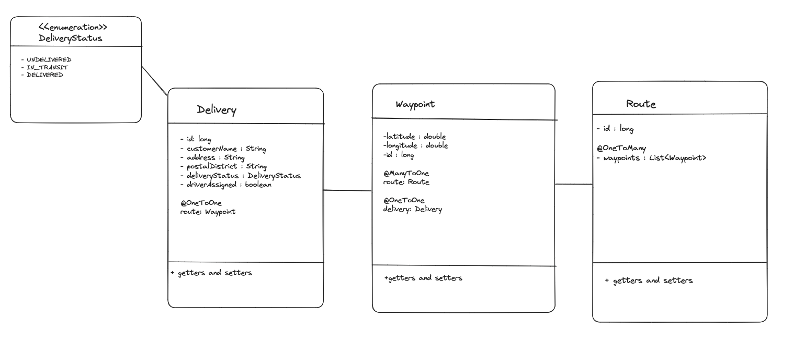

# Rainforest Retail - Deliveries

## Project Overview

RainforestRetail is a growing mail-order business facing challenges with its expanding delivery network. This project aims to digitise and optimise the route management system to better handle the increasing number of delivery hubs, customers, and orders. By generating efficient delivery routes, we aim to improve parcel delivery efficiency and streamline vehicle utilisation. The system will optimise van assignments based on parcel volume for specific regions and prioritise high volume postcodes. Additionally, it will seamlessly integrate new delivery vans into the network.

Currently, the fleet of delivery vehicles is being poorly utilised, with each van covering a fixed route daily regardless of delivery volume. This results in vehicles being either underloaded or overloaded which leads to inefficiencies. As a result, the company is likely to see delays as delivery times cannot be guaranteed, particularly during busy periods.

## Project Requirements

To complete this project, GPS trackers will need to be installed in each van. Delivery drivers must be trained to use the new software, and sufficient drivers must be hired for regional hubs to cope with peak periods. Transitioning to digital bookkeeping of parcel details at regional hubs will also be necessary.

## Project Benefits

Balancing workloads according to demand will reduce operational costs by minimising vehicle use, thereby reducing fuel consumption and maintenance costs. Reducing package idle time will increase delivery processing speed, leading to faster deliveries and increased capacity for more orders. Ensuring on-time deliveries during busy periods will enhance customer satisfaction, leading to repeat business and increased revenue from positive referrals.

This project will digitise and optimise RainforestRetail's delivery operations, resulting in more efficient, reliable, and cost-effective parcel delivery services.

## Potential Limitations

Several factors could prevent the success of this project. Adverse weather conditions, such as snow or rain, can impact delivery schedules. Delivery driver availability may also be a challenge due to sickness, holidays, or short staffing. The project will be heavily dependent on technology, which presents potential integration challenges with existing systems. Additionally, budget constraints might limit the acquisition of more vans.

## Tech Stack - Server Side

- **Java SE 17**
- **SpringBoot 3.3.0**
- **Hibernate**
- **PostgreSQL 15**

### Dependencies
- **Spring Web**
- **Spring Boot DevTools**
- **PostgreSQL Driver**
- **Spring Data JPA**

### How to run this API locally

1. **Install PostgreSQL**
   - Via Homebrew:
     ```sh
     brew install postgresql
     ```
   - Or via [Postgres.app](https://postgresapp.com)
  
2. **Create a database**
   ```sh
   createdb rainforest_retail_db
	```
	
3. **Fork repository**
   To your computer and run main() in ServerApplication

4. **Postico**
   You may wish to visualise the database in Postico once the database is created.

5. **Postman**
   Create models/ services / repositories.
   You may wish to visualise the endpoints in Postman using the JSON segments.


## Unified Modeling Language and Entity Relationship Diagram - MVP



## Tech Stack - Client Side

- **React**
- **Javascript**
- **[Leaflet](https://leafletjs.com)**

## Wireframe and Component Diagram - MVP


